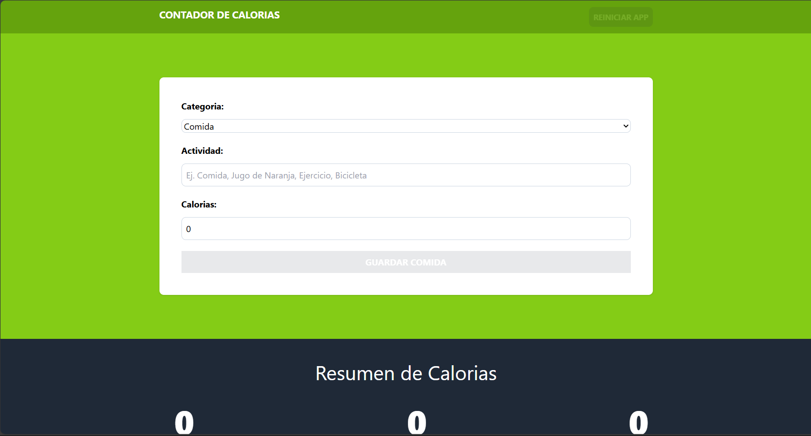

#Calorie Tracker

This Calorie Tracker were made using TypeScript, JS, Vite, and TailwindCSS

I learned a lot about using UseReducer, UseMemo and management of a general State. While I'm getting comfortable using TypeScript